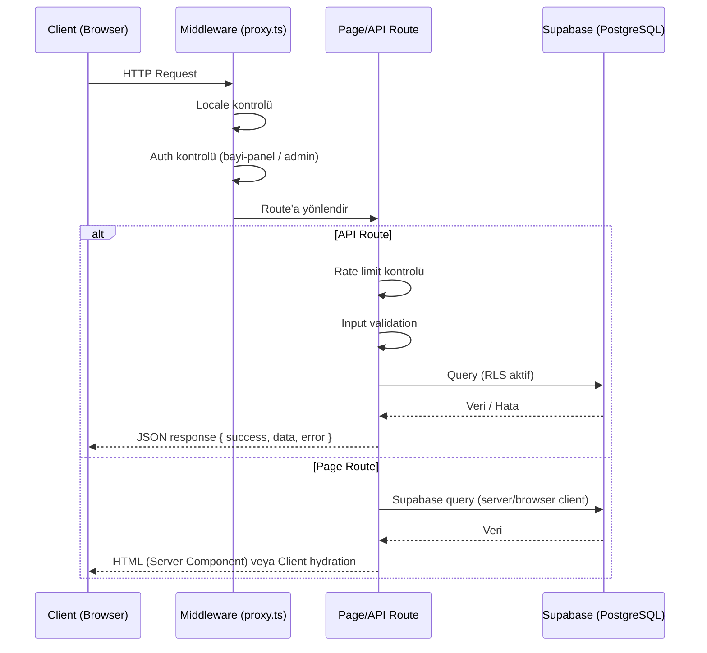
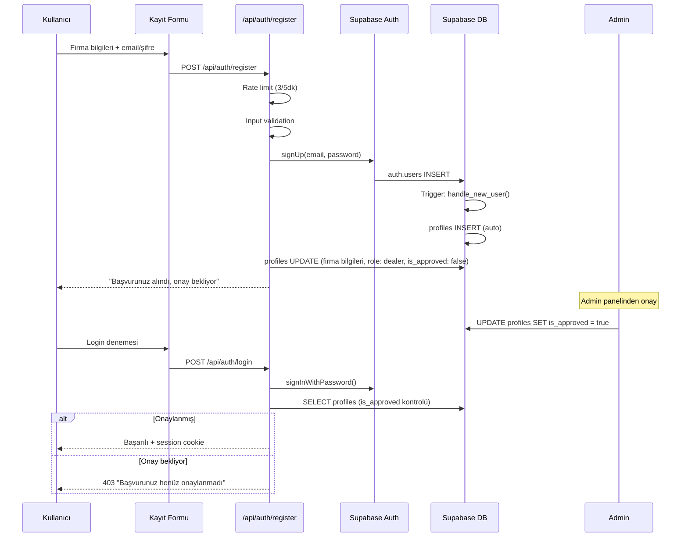
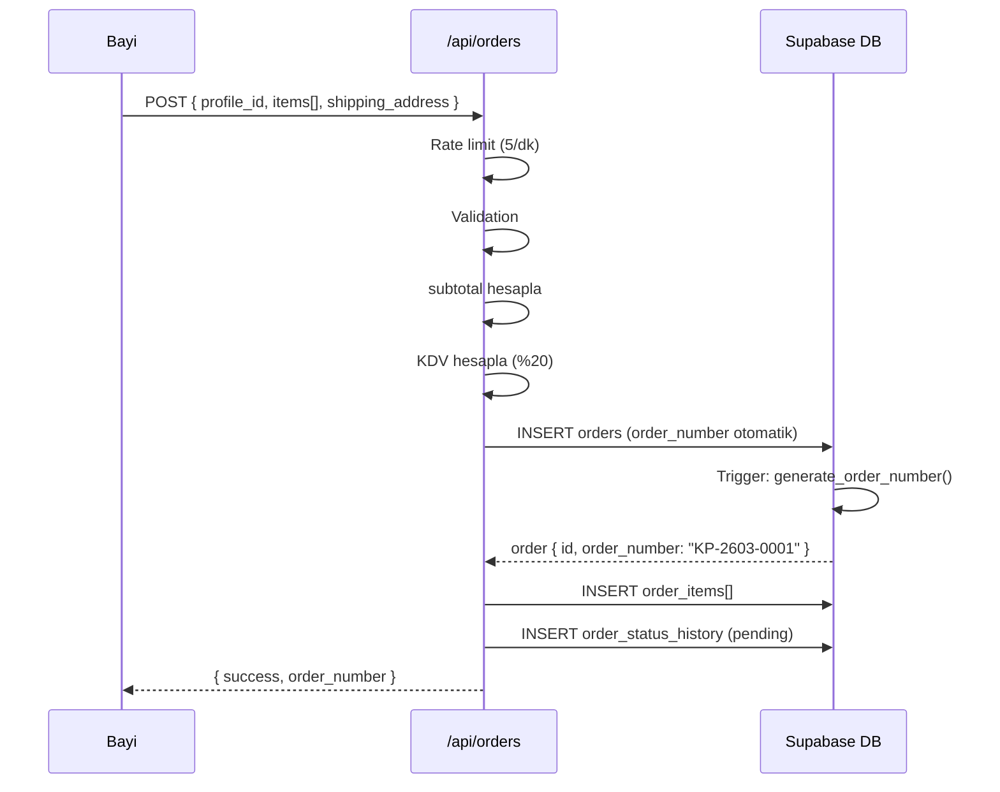

# Mimari Dokümantasyon — Kısmet Plastik B2B

Bu doküman projenin mimari yapısını, route organizasyonunu, veri akışını ve bileşen hiyerarşisini açıklar.

---

## Route Yapısı

Proje **Next.js 16 App Router** üzerinde çalışır. Üç ana alan vardır:

```
app/
├── [locale]/              # Herkese açık + B2B portal (tr/en)
│   ├── (public sayfalar)  # Auth gerektirmeyen sayfalar
│   ├── bayi-girisi/       # Bayi login
│   ├── bayi-kayit/        # Bayi kayıt
│   └── bayi-panel/        # B2B portal (auth zorunlu)
│       ├── page.tsx        # Dashboard
│       ├── siparislerim/   # Siparişler
│       ├── tekliflerim/    # Teklifler
│       ├── urunler/        # Ürün kataloğu
│       └── profilim/       # Profil yönetimi
├── admin/                 # Admin paneli (cookie auth)
│   ├── login/             # Admin giriş
│   ├── products/          # Ürün yönetimi
│   ├── blog/              # Blog yönetimi
│   ├── gallery/           # Galeri yönetimi
│   └── dealers/           # Bayi yönetimi
└── api/                   # API route'ları
    ├── auth/              # Bayi login/register
    ├── admin/             # Admin CRUD
    ├── orders/            # Sipariş API
    ├── quotes/            # Teklif API
    ├── contact/           # İletişim formu
    ├── gallery/           # Galeri API
    └── chat/              # AI chatbot
```

### Locale Routing

- Desteklenen diller: `tr` (varsayılan), `en`
- Middleware (`src/proxy.ts`) locale'siz URL'leri `/tr/...`'ye yönlendirir
- Tüm public sayfalar `[locale]` segmenti altında yer alır
- Admin paneli locale'den bağımsız çalışır (`/admin/...`)

### URL Slug'ları (Türkçe)

| Slug | Sayfa |
|------|-------|
| `/urunler` | Ürün kataloğu |
| `/urunler/[category]/[slug]` | Ürün detay |
| `/hakkimizda` | Hakkımızda |
| `/kalite` | Kalite |
| `/uretim` | Üretim |
| `/iletisim` | İletişim |
| `/teklif-al` | Teklif talep |
| `/katalog` | Katalog |
| `/blog` | Blog |
| `/sss` | SSS |
| `/kariyer` | Kariyer |
| `/bayi-girisi` | Bayi giriş |
| `/bayi-panel` | Bayi dashboard |
| `/galeri` | Galeri |
| `/sektorler` | Sektörler |
| `/fuarlar` | Fuarlar |
| `/surdurulebilirlik` | Sürdürülebilirlik |
| `/ambalaj-sozlugu` | Ambalaj sözlüğü |
| `/kvkk` | KVKK |
| `/vizyon-misyon` | Vizyon & Misyon |
| `/referanslar` | Referanslar |
| `/arge` | Ar-Ge |
| `/numune-talep` | Numune talep |
| `/urun-olustur` | Ürün oluşturucu |

---

## Veri Akışı

### Genel İstek Akışı



### Auth Akışı (Bayi Kaydı)



### Sipariş Oluşturma Akışı



---

## Auth Mimarisi

### İki Katmanlı Auth

| Katman | Mekanizma | Korunan Alan | Kontrol Noktası |
|--------|-----------|--------------|-----------------|
| Admin | Cookie (`admin-token`) | `/admin/*` | `src/proxy.ts` + `src/lib/auth.ts` |
| Bayi/Müşteri | Supabase Auth (JWT) | `/[locale]/bayi-panel/*` | `src/proxy.ts` (cookie varlığı) |

### Admin Auth Detayı

1. `POST /api/admin/auth` — şifre gönderilir
2. `timingSafeCompare()` ile `ADMIN_SECRET` karşılaştırılır
3. Başarılıysa `admin-token` cookie set edilir (httpOnly, secure, 24 saat)
4. Middleware her `/admin/*` isteğinde cookie'yi doğrular

### Bayi Auth Detayı

1. Kayıt: `POST /api/auth/register` → Supabase `signUp()` + profil oluştur
2. Login: `POST /api/auth/login` → Supabase `signInWithPassword()` + onay kontrolü
3. Middleware: `sb-*-auth-token` cookie varlığını kontrol eder
4. Yoksa `/bayi-girisi`'ne yönlendirir

### Supabase Client Kullanımı

| Client | Dosya | Kullanım Alanı |
|--------|-------|----------------|
| Genel (singleton) | `src/lib/supabase.ts` | API Route Handler'lar |
| Browser | `src/lib/supabase-browser.ts` | Client Component'lar |
| Server | `src/lib/supabase-server.ts` | Server Component'lar |

---

## Bileşen Hiyerarşisi

```
RootLayout (app/layout.tsx)
└── LocaleLayout (app/[locale]/layout.tsx)
    ├── Header (components/layout/Header.tsx)
    ├── [Sayfa İçeriği]
    │   ├── Server Components (varsayılan)
    │   │   └── Supabase query → HTML render
    │   └── Client Components ("use client")
    │       ├── ProductDetailClient → Product3DViewer, ProductViewer
    │       ├── CategoryClient → ProductFilter, ProductCard
    │       └── BlogDetailClient
    ├── Footer (components/layout/Footer.tsx)
    └── Dynamic Imports (lazy loaded)
        ├── WhatsAppButton
        ├── ScrollToTop
        ├── CookieBanner
        └── InstallPrompt

BayiPanelLayout (app/[locale]/bayi-panel/layout.tsx)
├── Sidebar (nav: dashboard, ürünler, teklifler, siparişler, profil)
└── Main Content
    ├── BayiPanelDashboard → stat kartlar, hızlı işlemler
    ├── Siparislerim
    ├── Tekliflerim
    ├── Urunler
    └── Profilim

AdminLayout (app/admin/layout.tsx)
├── Sidebar (nav: dashboard, ürünler, blog, galeri, bayiler)
└── Main Content
    ├── Dashboard
    ├── Products (list, new, [id])
    ├── Blog (list, new, [slug])
    ├── Gallery
    └── Dealers
```

### Component Konvansiyonları

- **Server Component** varsayılandır; `"use client"` sadece gerektiğinde kullanılır
- **shadcn/ui bileşenleri**: küçük harf dosya adı (`button.tsx`, `badge.tsx`)
- **Özel bileşenler**: PascalCase dosya adı (`ProductCard.tsx`, `StatusBadge.tsx`)
- **Sayfa client bileşenleri**: `src/components/pages/` altında
- **Ana sayfa section'ları**: `src/components/sections/` altında

---

## API Route Mimarisi

Tüm API route'ları standart bir yapı izler:

```typescript
// 1. Rate limiting (public endpoint'ler için)
const { ok } = rateLimit(`endpoint:${ip}`, { limit: N, windowMs: M });

// 2. Auth kontrolü (korumalı endpoint'ler için)
const authError = checkAuth(request);
if (authError) return authError;

// 3. Input validation
if (!requiredField) return NextResponse.json({ success: false, error: "..." });

// 4. Supabase query
const supabase = getSupabase();
const { data, error } = await supabase.from("table")...;

// 5. Response
return NextResponse.json({ success: true, data });
```

### API Endpoint'leri

| Endpoint | Method | Auth | Rate Limit | Açıklama |
|----------|--------|------|-----------|----------|
| `/api/auth/register` | POST | - | 3/5dk | Bayi kayıt |
| `/api/auth/login` | POST | - | 5/5dk | Bayi giriş |
| `/api/admin/auth` | POST/DELETE | - | - | Admin giriş/çıkış |
| `/api/contact` | POST | - | 5/dk | İletişim formu |
| `/api/quote` | POST | - | 3/dk | Teklif talep (public form) |
| `/api/quotes` | GET/POST | Admin/Auth | 3/dk | Teklif listesi/oluşturma |
| `/api/orders` | GET/POST | Admin/Auth | 5/dk | Sipariş listesi/oluşturma |
| `/api/orders/[id]` | GET/PATCH | Admin | - | Sipariş detay/güncelleme |
| `/api/gallery` | GET/POST | Auth(POST) | - | Galeri listesi/yükleme |
| `/api/gallery/[id]` | GET/PUT/DELETE | Admin | - | Galeri CRUD |
| `/api/admin/products` | GET/POST | Admin | - | Ürün listesi/oluşturma |
| `/api/admin/products/[id]` | GET/PUT/DELETE | Admin | - | Ürün CRUD |
| `/api/admin/blog` | GET/POST | Admin | - | Blog listesi/oluşturma |
| `/api/admin/blog/[slug]` | GET/PUT/DELETE | Admin | - | Blog CRUD |

---

## i18n (Çoklu Dil) Sistemi

- **Yaklaşım**: Dictionary-based (i18next kullanılmıyor)
- **Dosyalar**: `src/locales/tr.json`, `src/locales/en.json`
- **Loader**: `src/lib/i18n.ts` — locale parametresine göre JSON yükler
- **Context**: `src/contexts/LocaleContext.tsx` — `useLocale()` hook'u sağlar

```typescript
const { locale, dict, setLocale } = useLocale();
// locale: "tr" | "en"
// dict: çeviri dictionary objesi
// setLocale: dil değiştirme fonksiyonu
```

- **LocaleLink**: `src/components/ui/LocaleLink.tsx` — otomatik locale prefix ekler
- **Middleware**: `src/proxy.ts` — locale'siz URL'leri yönlendirir

---

## Güvenlik Önlemleri

| Önlem | Uygulama |
|-------|----------|
| Timing-safe karşılaştırma | `src/lib/auth.ts` — admin token doğrulama |
| Rate limiting | `src/lib/rate-limit.ts` — IP bazlı, in-memory |
| RLS (Row Level Security) | Tüm tablolarda aktif |
| httpOnly cookie | Admin token, Supabase session |
| HTML escaping | E-posta içeriğinde `escapeHtml()` |
| Input sanitization | `sanitizeSearchInput()` — SQL injection önleme |
| Security headers | `next.config.ts` — X-Frame-Options, CSP, XSS Protection |
| File upload limiti | Galeri: 10MB max, sadece JPEG/PNG/WebP |

---

## Performans Optimizasyonları

| Optimizasyon | Detay |
|-------------|-------|
| Dynamic import | WhatsApp, ScrollToTop, CookieBanner, InstallPrompt |
| Lazy loading | Product3DViewer (Three.js sadece gerektiğinde yüklenir) |
| Image optimization | AVIF/WebP, responsive deviceSizes |
| Font optimization | WOFF2, `font-display: swap`, preloading |
| Preconnect | Supabase, Google, WhatsApp, Maps |
| Service worker | Cache-first (statik), network-first (sayfa) |
| Static cache | `max-age=31536000, immutable` (font, image, sertifika) |
| Turbopack | Geliştirme sunucusunda etkin |

---

## Agent Sorumlulukları

Proje `.claude/agent/` altında tanımlanan AI agent'lar ile yönetilir:

| Agent | Sorumluluk |
|-------|-----------|
| `orchestrator` | Görev koordinasyonu, faz yönetimi |
| `architect` | Mimari kararlar, route yapısı |
| `frontend-developer` | UI bileşenleri, tasarım sistemi |
| `api-agent` | API route'ları, server-side mantık |
| `supabase-agent` | Veritabanı schema, migration, RLS |
| `auth-agent` | Auth sistemi, middleware, session |
| `security-agent` | Güvenlik audit, validation, headers |
| `code-reviewer` | Kod kalitesi, best practice kontrolü |
| `docs-agent` | Dokümantasyon |
| `test-agent` | Test yazma ve çalıştırma |
