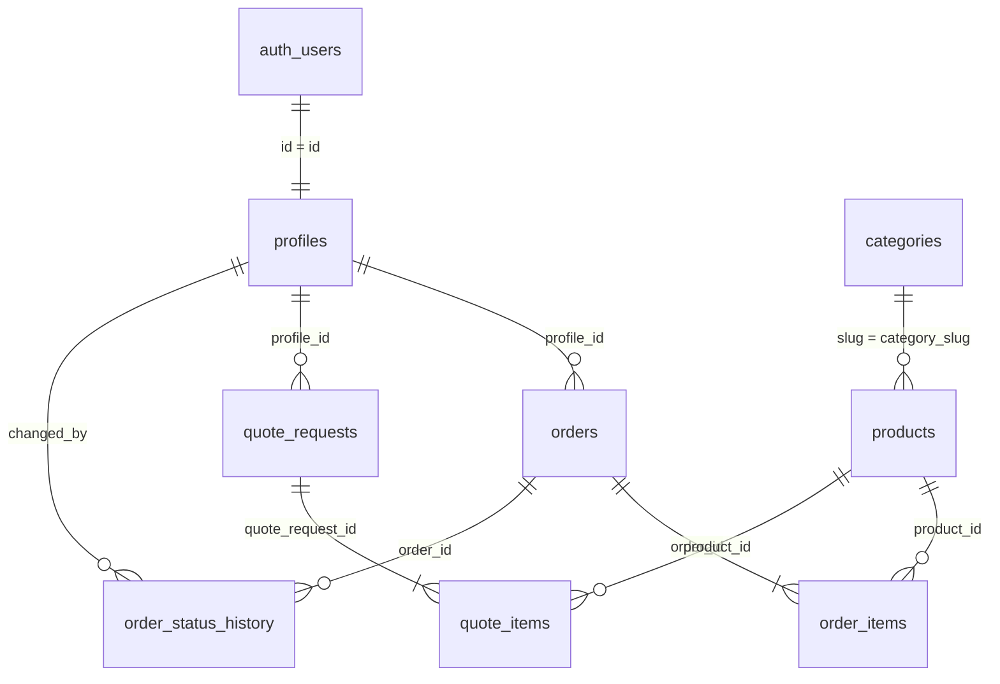

# Veritabanı Schema Dokümantasyonu

Bu doküman Kısmet Plastik B2B platformunun Supabase (PostgreSQL) veritabanı yapısını açıklar.

---

## Genel Bakış

Veritabanı 3 migration dosyasından oluşur ve toplam **12 tablo** içerir:

| Migration | Dosya | İçerik |
|-----------|-------|--------|
| 001 | `supabase-schema.sql` | Temel tablolar (categories, products, blog_posts) |
| 002 | `supabase-migration-002.sql` | B2B portal (profiles, orders, quotes, contact) |
| 003 | `supabase-migration-003.sql` | Galeri sistemi |

---

## İlişki Diyagramı



---

## Enum Tipleri

### user_role
```sql
CREATE TYPE user_role AS ENUM ('admin', 'dealer', 'customer');
```
| Değer | Açıklama |
|-------|----------|
| `admin` | Tam yetki — tüm tablolara erişim |
| `dealer` | Bayi — kendi siparişleri ve teklifleri |
| `customer` | Müşteri — teklif oluşturabilir |

### quote_status
```sql
CREATE TYPE quote_status AS ENUM ('pending', 'reviewing', 'quoted', 'accepted', 'rejected');
```
| Değer | Açıklama |
|-------|----------|
| `pending` | Yeni teklif talebi, henüz incelenmedi |
| `reviewing` | Admin tarafından inceleniyor |
| `quoted` | Fiyat teklifi gönderildi |
| `accepted` | Müşteri tarafından kabul edildi |
| `rejected` | Reddedildi |

### order_status
```sql
CREATE TYPE order_status AS ENUM ('pending', 'confirmed', 'production', 'shipping', 'delivered', 'cancelled');
```
| Değer | Açıklama |
|-------|----------|
| `pending` | Sipariş oluşturuldu, onay bekliyor |
| `confirmed` | Admin tarafından onaylandı |
| `production` | Üretimde |
| `shipping` | Kargoya verildi |
| `delivered` | Teslim edildi |
| `cancelled` | İptal edildi |

### payment_status
```sql
CREATE TYPE payment_status AS ENUM ('pending', 'paid', 'partial', 'refunded');
```

### gallery_category
```sql
CREATE TYPE gallery_category AS ENUM ('uretim', 'urunler', 'etkinlikler');
```

---

## Tablolar

### categories

Ürün kategorileri.

| Sütun | Tip | Kısıtlama | Açıklama |
|-------|-----|-----------|----------|
| `id` | UUID | PK | Otomatik oluşturulur |
| `slug` | TEXT | UNIQUE, NOT NULL | URL slug (ör: `pet-siseler`) |
| `name` | TEXT | NOT NULL | Kategori adı |
| `description` | TEXT | DEFAULT `''` | Açıklama |
| `product_count` | INTEGER | DEFAULT `0` | Ürün sayısı |
| `icon` | TEXT | — | İkon tanımlayıcı |
| `created_at` | TIMESTAMPTZ | DEFAULT `now()` | Oluşturulma tarihi |

**8 kategori:** `pet-siseler`, `plastik-siseler`, `kapaklar`, `tipalar`, `parmak-spreyler`, `pompalar`, `tetikli-pusturtuculer`, `huniler`

---

### products

Ürün kataloğu.

| Sütun | Tip | Kısıtlama | Açıklama |
|-------|-----|-----------|----------|
| `id` | UUID | PK | Otomatik oluşturulur |
| `slug` | TEXT | UNIQUE, NOT NULL | URL slug |
| `name` | TEXT | NOT NULL | Ürün adı |
| `category_slug` | TEXT | FK → categories(slug) | Kategori referansı |
| `description` | TEXT | DEFAULT `''` | Detaylı açıklama |
| `short_description` | TEXT | DEFAULT `''` | Kısa açıklama |
| `volume` | TEXT | — | Hacim (ör: `250ml`) |
| `weight` | TEXT | — | Ağırlık |
| `neck_diameter` | TEXT | — | Boyun çapı |
| `height` | TEXT | — | Yükseklik |
| `diameter` | TEXT | — | Çap |
| `material` | TEXT | DEFAULT `'PET'` | Malzeme (PET, HDPE, PP, LDPE) |
| `colors` | TEXT[] | DEFAULT `'{}'` | Renk seçenekleri dizisi |
| `color_codes` | JSONB | — | Renk hex kodları |
| `model` | TEXT | — | Model kodu |
| `shape` | TEXT | — | Şekil (düz, oval, silindir, yuvarlak) |
| `surface_type` | TEXT | — | Yüzey tipi |
| `compatible_caps` | TEXT[] | — | Uyumlu kapak slug'ları |
| `min_order` | INTEGER | DEFAULT `10000` | Minimum sipariş miktarı |
| `in_stock` | BOOLEAN | DEFAULT `true` | Stok durumu |
| `featured` | BOOLEAN | DEFAULT `false` | Öne çıkan ürün |
| `specs` | JSONB | DEFAULT `'[]'` | Teknik özellikler `[{label, value}]` |
| `created_at` | TIMESTAMPTZ | DEFAULT `now()` | Oluşturulma |
| `updated_at` | TIMESTAMPTZ | DEFAULT `now()` | Son güncelleme (trigger) |

**İndeksler:** `category_slug`, `featured`, `in_stock`

---

### blog_posts

Blog yazıları.

| Sütun | Tip | Kısıtlama | Açıklama |
|-------|-----|-----------|----------|
| `id` | UUID | PK | Otomatik oluşturulur |
| `slug` | TEXT | UNIQUE, NOT NULL | URL slug |
| `title` | TEXT | NOT NULL | Başlık |
| `excerpt` | TEXT | DEFAULT `''` | Özet |
| `content` | TEXT[] | DEFAULT `'{}'` | İçerik blokları dizisi |
| `category` | TEXT | DEFAULT `'Bilgi'` | Kategori |
| `date` | DATE | DEFAULT `CURRENT_DATE` | Yayın tarihi |
| `read_time` | TEXT | DEFAULT `'5 dk'` | Okuma süresi |
| `featured` | BOOLEAN | DEFAULT `false` | Öne çıkan |
| `created_at` | TIMESTAMPTZ | DEFAULT `now()` | Oluşturulma |
| `updated_at` | TIMESTAMPTZ | DEFAULT `now()` | Son güncelleme (trigger) |

---

### profiles

Kullanıcı profilleri. `auth.users` tablosuna bağlıdır.

| Sütun | Tip | Kısıtlama | Açıklama |
|-------|-----|-----------|----------|
| `id` | UUID | PK, FK → auth.users(id) | Supabase user ID |
| `email` | TEXT | NOT NULL | E-posta |
| `full_name` | TEXT | DEFAULT `''` | Ad soyad |
| `phone` | TEXT | — | Telefon |
| `company_name` | TEXT | — | Firma adı |
| `tax_number` | TEXT | — | Vergi numarası |
| `tax_office` | TEXT | — | Vergi dairesi |
| `company_address` | TEXT | — | Firma adresi |
| `city` | TEXT | — | İl |
| `district` | TEXT | — | İlçe |
| `role` | user_role | DEFAULT `'customer'` | Rol |
| `is_approved` | BOOLEAN | DEFAULT `false` | Onay durumu |
| `avatar_url` | TEXT | — | Profil fotoğrafı URL'i |
| `notes` | TEXT | — | Admin notları |
| `created_at` | TIMESTAMPTZ | DEFAULT `now()` | Oluşturulma |
| `updated_at` | TIMESTAMPTZ | DEFAULT `now()` | Son güncelleme (trigger) |

**İndeksler:** `role`, `is_approved`

---

### quote_requests

Teklif talepleri.

| Sütun | Tip | Kısıtlama | Açıklama |
|-------|-----|-----------|----------|
| `id` | UUID | PK | Otomatik oluşturulur |
| `profile_id` | UUID | FK → profiles(id), nullable | Auth kullanıcısı (opsiyonel) |
| `company_name` | TEXT | NOT NULL | Firma adı |
| `contact_name` | TEXT | NOT NULL | İlgili kişi |
| `email` | TEXT | NOT NULL | E-posta |
| `phone` | TEXT | NOT NULL | Telefon |
| `message` | TEXT | — | Ek notlar |
| `status` | quote_status | DEFAULT `'pending'` | Durum |
| `admin_notes` | TEXT | — | Admin notları |
| `total_amount` | NUMERIC(12,2) | — | Toplam tutar |
| `valid_until` | DATE | — | Teklif geçerlilik tarihi |
| `created_at` | TIMESTAMPTZ | DEFAULT `now()` | Oluşturulma |
| `updated_at` | TIMESTAMPTZ | DEFAULT `now()` | Son güncelleme (trigger) |

**İndeksler:** `status`, `profile_id`

---

### quote_items

Teklif kalemleri.

| Sütun | Tip | Kısıtlama | Açıklama |
|-------|-----|-----------|----------|
| `id` | UUID | PK | Otomatik oluşturulur |
| `quote_request_id` | UUID | FK → quote_requests(id) CASCADE | Teklif referansı |
| `product_id` | UUID | FK → products(id) SET NULL | Ürün referansı (opsiyonel) |
| `product_name` | TEXT | NOT NULL | Ürün adı (denormalize) |
| `quantity` | INTEGER | DEFAULT `1` | Miktar |
| `unit_price` | NUMERIC(12,2) | — | Birim fiyat |
| `notes` | TEXT | — | Kalem notu |
| `created_at` | TIMESTAMPTZ | DEFAULT `now()` | Oluşturulma |

---

### orders

Siparişler.

| Sütun | Tip | Kısıtlama | Açıklama |
|-------|-----|-----------|----------|
| `id` | UUID | PK | Otomatik oluşturulur |
| `profile_id` | UUID | FK → profiles(id) RESTRICT | Sipariş sahibi |
| `order_number` | TEXT | UNIQUE, NOT NULL | Otomatik (ör: `KP-2603-0001`) |
| `status` | order_status | DEFAULT `'pending'` | Sipariş durumu |
| `shipping_address` | JSONB | — | Teslimat adresi |
| `billing_address` | JSONB | — | Fatura adresi |
| `subtotal` | NUMERIC(12,2) | DEFAULT `0` | Ara toplam |
| `tax_amount` | NUMERIC(12,2) | DEFAULT `0` | KDV (%20) |
| `shipping_cost` | NUMERIC(12,2) | DEFAULT `0` | Kargo ücreti |
| `total_amount` | NUMERIC(12,2) | DEFAULT `0` | Genel toplam |
| `payment_method` | TEXT | — | Ödeme yöntemi (varsayılan: havale) |
| `payment_status` | payment_status | DEFAULT `'pending'` | Ödeme durumu |
| `tracking_number` | TEXT | — | Kargo takip numarası |
| `estimated_delivery` | DATE | — | Tahmini teslimat |
| `notes` | TEXT | — | Müşteri notları |
| `admin_notes` | TEXT | — | Admin notları |
| `created_at` | TIMESTAMPTZ | DEFAULT `now()` | Oluşturulma |
| `updated_at` | TIMESTAMPTZ | DEFAULT `now()` | Son güncelleme (trigger) |

**İndeksler:** `profile_id`, `status`, `order_number`

---

### order_items

Sipariş kalemleri.

| Sütun | Tip | Kısıtlama | Açıklama |
|-------|-----|-----------|----------|
| `id` | UUID | PK | Otomatik oluşturulur |
| `order_id` | UUID | FK → orders(id) CASCADE | Sipariş referansı |
| `product_id` | UUID | FK → products(id) SET NULL | Ürün referansı |
| `product_name` | TEXT | NOT NULL | Ürün adı (denormalize) |
| `quantity` | INTEGER | DEFAULT `1` | Miktar |
| `unit_price` | NUMERIC(12,2) | DEFAULT `0` | Birim fiyat |
| `total_price` | NUMERIC(12,2) | DEFAULT `0` | Kalem toplamı |
| `notes` | TEXT | — | Kalem notu |
| `created_at` | TIMESTAMPTZ | DEFAULT `now()` | Oluşturulma |

**İndeks:** `order_id`

---

### order_status_history

Sipariş durum değişiklik geçmişi.

| Sütun | Tip | Kısıtlama | Açıklama |
|-------|-----|-----------|----------|
| `id` | UUID | PK | Otomatik oluşturulur |
| `order_id` | UUID | FK → orders(id) CASCADE | Sipariş referansı |
| `old_status` | order_status | nullable | Önceki durum |
| `new_status` | order_status | NOT NULL | Yeni durum |
| `changed_by` | UUID | FK → profiles(id) | Değiştiren kullanıcı |
| `note` | TEXT | — | Değişiklik notu |
| `created_at` | TIMESTAMPTZ | DEFAULT `now()` | Değişiklik tarihi |

---

### contact_messages

İletişim formu mesajları.

| Sütun | Tip | Kısıtlama | Açıklama |
|-------|-----|-----------|----------|
| `id` | UUID | PK | Otomatik oluşturulur |
| `name` | TEXT | NOT NULL | Gönderen adı |
| `email` | TEXT | NOT NULL | E-posta |
| `phone` | TEXT | — | Telefon |
| `company` | TEXT | — | Firma |
| `subject` | TEXT | NOT NULL | Konu |
| `message` | TEXT | NOT NULL | Mesaj |
| `is_read` | BOOLEAN | DEFAULT `false` | Okundu durumu |
| `admin_notes` | TEXT | — | Admin notları |
| `created_at` | TIMESTAMPTZ | DEFAULT `now()` | Gönderilme tarihi |

**İndeks:** `is_read`

---

### catalog_downloads

Katalog indirme takibi.

| Sütun | Tip | Kısıtlama | Açıklama |
|-------|-----|-----------|----------|
| `id` | UUID | PK | Otomatik oluşturulur |
| `name` | TEXT | — | İndiren kişi |
| `email` | TEXT | NOT NULL | E-posta |
| `company` | TEXT | — | Firma |
| `phone` | TEXT | — | Telefon |
| `downloaded_at` | TIMESTAMPTZ | DEFAULT `now()` | İndirme tarihi |

---

### gallery_images

Galeri görselleri. Çift dilli başlık/açıklama destekler.

| Sütun | Tip | Kısıtlama | Açıklama |
|-------|-----|-----------|----------|
| `id` | UUID | PK | Otomatik oluşturulur |
| `category` | gallery_category | DEFAULT `'uretim'` | Kategori |
| `title_tr` | TEXT | DEFAULT `''` | Türkçe başlık |
| `title_en` | TEXT | DEFAULT `''` | İngilizce başlık |
| `description_tr` | TEXT | — | Türkçe açıklama |
| `description_en` | TEXT | — | İngilizce açıklama |
| `image_url` | TEXT | NOT NULL | Public URL |
| `storage_path` | TEXT | NOT NULL | Storage bucket path |
| `display_order` | INT | DEFAULT `0` | Sıralama |
| `is_active` | BOOLEAN | DEFAULT `true` | Aktiflik |
| `created_at` | TIMESTAMPTZ | DEFAULT `now()` | Oluşturulma |
| `updated_at` | TIMESTAMPTZ | DEFAULT `now()` | Son güncelleme (trigger) |

**İndeksler:** `category`, `is_active`, `display_order`

---

## RLS (Row Level Security) Politikaları

Tüm tablolarda RLS aktiftir. Politika yapısı:

### Public Tablolar (categories, products, blog_posts)

```sql
-- Herkes okuyabilir
CREATE POLICY "Public read" FOR SELECT USING (true);
-- Service role ile yazma (admin API)
CREATE POLICY "Service write" FOR ALL USING (true) WITH CHECK (true);
```

### Profiller (profiles)

```sql
-- Kullanıcı kendi profilini okuyabilir
CREATE POLICY "Users read own profile" FOR SELECT USING (auth.uid() = id);
-- Kullanıcı kendi profilini güncelleyebilir
CREATE POLICY "Users update own profile" FOR UPDATE USING (auth.uid() = id);
-- Service role tam yetki
CREATE POLICY "Service manage profiles" FOR ALL USING (true) WITH CHECK (true);
```

### Teklifler (quote_requests, quote_items)

```sql
-- Kullanıcı kendi tekliflerini görebilir
CREATE POLICY "Users read own quotes" FOR SELECT USING (auth.uid() = profile_id);
-- Herkes teklif gönderebilir (auth opsiyonel)
CREATE POLICY "Anyone insert quotes" FOR INSERT WITH CHECK (true);
```

### Siparişler (orders, order_items, order_status_history)

```sql
-- Kullanıcı kendi siparişlerini görebilir
CREATE POLICY "Users read own orders" FOR SELECT USING (auth.uid() = profile_id);
-- Kullanıcı kendi siparişini oluşturabilir
CREATE POLICY "Users insert own orders" FOR INSERT WITH CHECK (auth.uid() = profile_id);
```

### Galeri (gallery_images)

```sql
-- Aktif görseller herkese açık
CREATE POLICY "gallery_public_read" FOR SELECT USING (is_active = true);
-- Admin tam yetki
CREATE POLICY "gallery_admin_all" FOR ALL USING (
  EXISTS (SELECT 1 FROM profiles WHERE id = auth.uid() AND role = 'admin')
);
```

### İletişim & Katalog (contact_messages, catalog_downloads)

```sql
-- Herkes form gönderebilir
CREATE POLICY "Anyone insert" FOR INSERT WITH CHECK (true);
-- Service role ile okuma/yönetim
CREATE POLICY "Service manage" FOR ALL USING (true) WITH CHECK (true);
```

---

## Helper Fonksiyonlar

### update_updated_at()

Tüm tablolardaki `updated_at` sütununu otomatik günceller.

```sql
CREATE OR REPLACE FUNCTION update_updated_at()
RETURNS TRIGGER AS $$
BEGIN
  NEW.updated_at = now();
  RETURN NEW;
END;
$$ LANGUAGE plpgsql;
```

**Kullanılan tablolar:** products, blog_posts, profiles, quote_requests, orders, gallery_images

### generate_order_number()

Sipariş numarası otomatik oluşturur. Format: `KP-YYMM-NNNN`

```sql
CREATE OR REPLACE FUNCTION generate_order_number()
RETURNS TRIGGER AS $$
BEGIN
  NEW.order_number := 'KP-' || to_char(now(), 'YYMM') || '-' || lpad(nextval('order_number_seq')::text, 4, '0');
  RETURN NEW;
END;
$$ LANGUAGE plpgsql;
```

**Örnek:** `KP-2603-0001`, `KP-2603-0002`, ...

**Sequence:** `order_number_seq` (başlangıç: 1)

### handle_new_user()

Yeni auth kullanıcısı için otomatik profil oluşturur.

```sql
CREATE OR REPLACE FUNCTION handle_new_user()
RETURNS TRIGGER AS $$
BEGIN
  INSERT INTO profiles (id, email, full_name)
  VALUES (
    NEW.id,
    NEW.email,
    COALESCE(NEW.raw_user_meta_data->>'full_name', '')
  );
  RETURN NEW;
END;
$$ LANGUAGE plpgsql SECURITY DEFINER;
```

**Trigger:** `on_auth_user_created` — `AFTER INSERT ON auth.users`

---

## Storage Bucket

### gallery

| Ayar | Değer |
|------|-------|
| Bucket ID | `gallery` |
| Public | Evet |
| Dosya boyut limiti | 10MB |
| İzin verilen MIME | `image/jpeg`, `image/png`, `image/webp` |

**Storage RLS:**
- Public read: Tüm gallery bucket dosyaları okunabilir
- Admin insert/delete: Sadece `role = 'admin'` olan kullanıcılar yükleyebilir/silebilir

---

## Migration Dosyaları

| Dosya | Sıra | İçerik |
|-------|------|--------|
| `docs/supabase-schema.sql` | 1 | categories, products, blog_posts + RLS + trigger |
| `docs/supabase-migration-002.sql` | 2 | profiles, quote_requests, quote_items, orders, order_items, contact_messages, catalog_downloads, order_status_history + enum'lar + trigger'lar + RLS |
| `docs/supabase-migration-003.sql` | 3 | gallery_images + gallery storage bucket + RLS |

**Kurulum sırası:** Migration'lar yukarıdaki sırayla çalıştırılmalıdır. Migration 002, migration 001'deki `update_updated_at()` fonksiyonuna bağlıdır.
